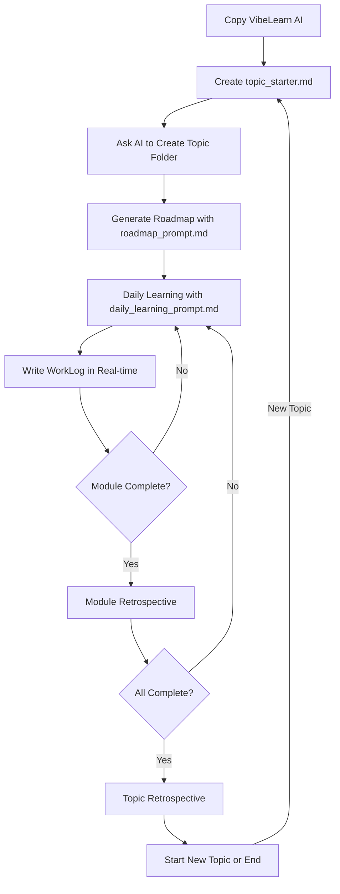

# VibeLearn AI Quick Start Guide

🌐 **Language / 언어**: [한국어](GETTING_STARTED.md) | [English](GETTING_STARTED.en.md)

**Version**: 2.0
**Last Updated**: 2025-12-28

---

## 🎯 What is VibeLearn AI?

**VibeLearn AI** is a learning methodology for systematically learning new technologies with AI and turning the outputs generated in the process into high-quality "textbooks" that other learners can use.

**Core Philosophy**:
> "Learn with AI, structure what you've learned, and pave the way for the next learner."

---

## 🚀 Get Started in 5 Minutes

### Step 0: Before You Begin

**Files included in the VibeLearn AI_v2.0 folder**:
```
VibeLearn AI_v2.0/
├── README.en.md                     # Introduction to the VibeLearn AI methodology (Recommended to read first!)
├── GETTING_STARTED.en.md           # This file - Quick Start Guide
└── templates/
    ├── topic_starter.en.md         # Topic start template
    ├── roadmap_prompt_template.en.md # Roadmap generation template
    └── daily_learning_prompt.en.md   # Daily learning prompt
```

**💡 Recommended Order**:
1.  **Read README.en.md first** - Understand the philosophy and overall structure of the VibeLearn AI methodology.
2.  **Practice with this guide (GETTING_STARTED.en.md)** - Follow the steps to start learning.

---

### Step 1: Prepare for Learning

If you have the VibeLearn AI_v2.0 folder, you can start right away!

**What you need**:
- ✅ This folder (VibeLearn AI_v2.0/)
- ✅ An AI assistant (Claude, ChatGPT, Gemini, etc. - Vibe Coding Tools recommended)
- ✅ A Topic you want to learn and the will to learn

**Optional**:
- Git repository (for version control and sharing your learning process)

---

### Step 2: Create the Topic Starter File

**💡 Recommended Method: Create it by talking to an AI**

If you're unsure how to fill out `topic_starter.md`, use the prompt below with your AI!

```
"I want to learn about [Topic Name]. Can you help me create the topic_starter.md file?
I want to finish in [duration] and achieve [goal].

Please ask me multiple-choice questions (radio buttons/checkboxes) to gather the necessary information according to the VibeLearn AI methodology and create the file with me."
```

**Example**:
```
"I want to learn about Deep Agent technology. Can you help me create the topic_starter.md file?
I want to finish in 2 weeks and actually build an AI Application.

Please ask me multiple-choice questions (radio buttons/checkboxes) to gather the necessary information according to the VibeLearn AI methodology and create the file with me."
```

**What the AI does**:
1.  **Asks structured questions** (You can answer easily with multiple-choice)
    -   What are your learning objectives? (Checkboxes)
    -   What is your level of prior knowledge? (Radio buttons)
    -   What is your learning environment? (Checkboxes)
    -   What is your practice project? (Radio buttons)

2.  **Creates `topic_starter.md` reflecting your answers**
    -   Generates a complete file with all sections filled out.
    -   Structures it according to the VibeLearn AI template format.

3.  **Saves the file**
    -   Saves it as `templates/[YourTopic]_topic_starter.md` (relative to the VibeLearn AI_v2.0 folder).

**Key Advantages**:
- ✅ Quick selection with radio buttons/checkboxes
- ✅ The AI systematically collects the necessary information
- ✅ Generates a complete, ready-to-use file

**How to create it manually**:

```bash
# Copy the topic_starter.md template
cp templates/topic_starter.md [YourTopic]_topic_starter.md

# Example
cp templates/topic_starter.md Docker-Basics_topic_starter.md
```

**Example of a filled-out file**:
```markdown
## 📌 Topic Basic Information
Topic Name: Docker-Basics
Description: Basic concepts and practice of Docker container technology
Learning Purpose: Improve productivity by containerizing the development environment
Estimated Duration: 2 weeks

## 🎯 Learning Objectives
- [ ] Understand the concepts of Docker images and containers
- [ ] Ability to write a Dockerfile
- [ ] Ability to use docker-compose

## 🛠️ Learning Environment
OS: Windows 11
Main Tools:
- Docker Desktop
- VS Code
```

**Key takeaway**: Creating the file in conversation with an AI helps you build a more specific and achievable learning plan!

---

### Step 3: Ask the AI to Create the Topic Folder

Once `topic_starter.md` is complete, use the following prompt with your AI.

**Prompt Template**:
```
"Please look at the `[YourTopic]_topic_starter.md` file and create a Topic folder that follows the VibeLearn AI methodology.

Once done, please guide me on what to do for the next step."
```

**Example**:
```
"Please look at the `DeepAgent_topic_starter.md` file and create a Topic folder that follows the VibeLearn AI methodology.

Once done, please guide me on what to do for the next step."
```

**What the AI does**:
1.  **Automatically creates the Topic folder structure**
    ```
    VibeLearn AI_v2.0/Topics/Deep-Agent/  # Created under the Topics folder
    ├── topic_info.md              # Content from topic_starter is copied here
    ├── vl_prompts/
    │   ├── roadmap_prompt.md      # Prompt injected with Topic info
    │   └── daily_learning_prompt.md
    ├── vl_roadmap/                # Location for the roadmap
    ├── vl_worklog/                # Location for learning logs
    └── vl_materials/              # Reference materials (optional)
    ```

2.  **Guides you to the next step**
    -   Explains how to generate the Roadmap.
    -   Provides the path to the necessary prompt file.
    -   Confirms you are ready to start learning.

---

### Step 4: Generate the Learning Roadmap

Once the Topic folder is created, use the prompt below with your AI.

**Prompt Template**:
```
"Please read the `Topics/[TopicName]/vl_prompts/roadmap_prompt.md` file and generate a learning roadmap.

Once done, please guide me on what to do for the next step."
```

**Example**:
```
"Please read the `Topics/Deep-Agent/vl_prompts/roadmap_prompt.md` file and generate a learning roadmap.

Once done, please guide me on what to do for the next step."
```

**What the AI does**:
1.  **Reviews the appropriateness of the learning duration** (STEP 1)
    -   Analyzes the Topic's complexity.
    -   Evaluates the adequacy of the duration you entered.
    -   Provides feedback (appropriate/too short/too long).
    -   Waits for user confirmation.

2.  **Generates the roadmap after user confirmation** (STEP 2)
    -   Creates a module-by-module learning plan.
    -   Defines objectives, activities, and DoD for each module.
    -   Creates the `vl_roadmap/YYYYMMDD_RoadMap_[Topic].md` file.

3.  **Guides you to the next step**
    -   Explains how to start your daily learning.
    -   Shows how to use `daily_learning_prompt.md`.

---

### Step 5: Start Your Daily Learning

Once the Roadmap is ready, use this prompt with your AI every day you study.

**Prompt Template**:
```
"Please read the `Topics/[TopicName]/vl_prompts/daily_learning_prompt.md` file and help me with today's learning.

Current Status:
- Roadmap file: Topics/[TopicName]/vl_roadmap/YYYYMMDD_RoadMap_[Topic].md
- Current Module: M[N] - [Module Name]
- Most recent WorkLog: [Filename or 'None - first session']
- Available time: [X hours]"
```

**Example**:
```
"Please read the `Topics/Deep-Agent/vl_prompts/daily_learning_prompt.md` file and help me with today's learning.

Current Status:
- Roadmap file: Topics/Deep-Agent/vl_roadmap/20251228_RoadMap_Deep-Agent.md
- Current Module: M1 - Deep Agent Concepts
- Most recent WorkLog: None - first session
- Available time: 3 hours"
```

**What the AI does**:
1.  **Analyzes the Roadmap and previous WorkLog**
    -   Identifies the current module's goals and DoD.
    -   Checks for any unfinished tasks.

2.  **Creates today's learning plan**
    -   Determines priorities.
    -   Allocates time (with a 20% buffer).
    -   Provides a list of specific activities.

3.  **Starts the learning session after user approval**
    -   Guides you to create the WorkLog file.
    -   Provides real-time learning support.
    -   Answers questions and helps with debugging.

---

## 📖 Overall Learning Flow



---

## 📁 Understanding the Folder Structure

### Distribution Package Structure
```
VibeLearn AI_v2.0/                    # Distribution package (this folder)
├── README.en.md                 # Full methodology description
├── GETTING_STARTED.en.md       # Quick start guide (this file)
└── templates/                  # Template files
    ├── topic_starter.en.md     # Topic start template
    ├── roadmap_prompt_template.en.md # Roadmap generation template
    └── daily_learning_prompt.en.md   # Daily learning prompt
```

### Structure After Starting Learning (Example)
```
VibeLearn AI_v2.0/                   # Distribution package (root)
├── README.en.md
├── GETTING_STARTED.en.md
├── templates/
│   ├── topic_starter.en.md
│   ├── roadmap_prompt_template.en.md
│   └── daily_learning_prompt.en.md
└── Topics/                    # Folder for managing Topics (created by AI)
    ├── Deep-Agent/            # First Topic
    │   ├── topic_info.md
    │   ├── vl_prompts/
    │   ├── vl_roadmap/
    │   ├── vl_worklog/
    │   └── vl_materials/
    └── Docker-Basics/         # Second Topic
        ├── topic_info.md
        ├── vl_prompts/
        └── ...
```

### Topic Folder Structure
```
[TopicName]/
├── topic_info.md               # Topic information
├── vl_prompts/                 # Prompt files
│   ├── roadmap_prompt.md
│   └── daily_learning_prompt.md
├── vl_roadmap/                 # Learning roadmap
│   └── YYYYMMDD_RoadMap_[Topic].md
├── vl_worklog/                 # Learning logs
│   ├── YYYYMMDD_M1_[Topic].md
│   ├── YYYYMMDD_M2_[Topic].md
│   └── ...
├── vl_materials/               # Reference materials (Optional)
└── 01-ModuleName/              # Learning outputs
    ├── README.md
    ├── concepts/
    ├── examples/
    └── guides/
```

---

## 🎓 Detailed Learning Process

### 1. Start a Topic (Once)

**Goal**: Create the Topic folder structure and establish a Roadmap.

1.  **Create `topic_starter.md`** (15-30 min)
    -   Enter Topic information.
    -   Set learning objectives.
    -   List environment and reference materials.

2.  **Ask AI to create the folder** (5 min)
    -   Provide the `topic_starter.md`.
    -   The folder is created automatically.
    -   Prompt files are prepared.

3.  **Generate Roadmap** (30-60 min)
    -   Provide the `roadmap_prompt.md`.
    -   The AI creates a module-by-module plan.
    -   Review and adjust.

---

### 2. Daily Learning (Iterative)

**Goal**: Plan → Execute → Document → Reflect

#### Start Learning (10-15 min)
1.  **Fill out `daily_learning_prompt.md`**
    -   Enter current status information.
    -   Enter available time.
    -   Send to the AI.

2.  **AI proposes a learning plan**
    -   Analyzes Roadmap and previous WorkLog.
    -   Suggests today's goals and activities.
    -   Provides a time allocation plan.

3.  **Approve the plan**
    -   Request adjustments if needed.
    -   Respond with "Let's start."

#### Proceed with Learning (1-3 hours)
1.  **Create a WorkLog file**
    -   Use the template provided by the AI.
    -   Write in it in real-time.

2.  **Execute activities**
    -   Learn concepts.
    -   Do the practice exercises.
    -   Create outputs.

3.  **Track progress**
    -   Check off completed tasks.
    -   Record any problems that arise.
    -   Update DoD completion rate.

#### End Learning (10-15 min)
1.  **Documentation**
    -   Organize the output folders.
    -   Write `README.md` files.

2.  **Daily Retrospective**
    -   What went well?
    -   What could be improved?
    -   Insights.
    -   Tomorrow's focus.

3.  **Finalize WorkLog**
    -   Final review.
    -   Git commit (optional).

---

### 3. Module Completion (Once per module)

**Goal**: Module retrospective and preparation for the next module.

1.  **Write Module Retrospective** (15-20 min)
    -   Compare plan vs. actual.
    -   Summarize key learnings.
    -   Self-Assessment.

2.  **Update Roadmap**
    -   Mark the module as complete.
    -   Adjust subsequent modules if necessary.

---

### 4. Topic Completion (Once per Topic)

**Goal**: Overall retrospective and final organization of outputs.

1.  **Write Topic Retrospective** (30-60 min)
    -   Summarize the entire learning journey.
    -   Evaluate the methodology's effectiveness.
    -   Identify improvements.

2.  **Verify Outputs**
    -   Check for "textbook" quality.
    -   Verify links and examples.

3.  **Share** (Optional)
    -   Make public on GitHub.
    -   Share with the community.

---

## 💡 Learning Tips

### ✅ Do's (Recommended)

1.  **Write a WorkLog every day**
    -   Real-time recording makes retrospectives easier.
    -   Detail your problem-solving process.

2.  **Prioritize practice**
    -   30% theory, 70% practice.
    -   Experiencing "small wins" is important.

3.  **Actively use AI**
    -   Ask immediately when you get stuck.
    -   Request code reviews.
    -   Get suggestions for debugging directions.

4.  **Maintain output quality**
    -   A `README.md` is essential.
    -   Make sure other learners can understand it.

5.  **Don't skip retrospectives**
    -   Daily: Invest 5-10 minutes.
    -   Module: Invest 15-20 minutes.
    -   This improves the learning method itself.

### ❌ Don'ts (To be avoided)

1.  **Perfectionism**
    -   Memorizing every detail is unnecessary.
    -   Being able to instruct an AI is sufficient.

2.  **Only writing documents**
    -   Don't just read theory without practice.
    -   Always execute the code yourself.

3.  **Proceeding without a plan**
    -   Don't skip `daily_learning_prompt.md`.
    -   Starting without a plan is inefficient.

4.  **Omitting outputs**
    -   Create at least one folder per module.
    -   Don't just write code without documenting it.

---

## ❓ FAQ

### Q1. Can I use this without an AI?
**A**: **No, an AI is essential.** The "Vibe Learning" in VibeLearn AI is centered around collaboration with an AI.

**Why is an AI essential?**
-   **Roadmap Generation**: The AI analyzes Topic information to create a structured learning plan.
-   **Daily Learning**: The AI understands your progress and suggests a plan for each day.
-   **Real-time Learning Support**: Get immediate answers when you're stuck.
-   **Code Review and Debugging**: The AI helps verify your code and solve problems.
-   **WorkLog Writing Support**: The AI guides you in creating structured records.

**Recommended AI Tools** (Vibe Coding Tools that run in a CLI environment):

**IDE/Editor Integrated Tools**:
-   **Claude Code** (VS Code Extension) - Recommended
-   **Cursor AI** (AI-integrated editor)
-   **GitHub Copilot** (VS Code, Cursor, etc.)
-   **Cline** (VS Code Extension)

**Terminal/CLI Tools**:
-   **Claude Code CLI** (Use Claude in the terminal)
-   **GitHub Copilot CLI**
-   **OpenAI Codex CLI**

**Web-based (Auxiliary)**:
-   Claude.ai, ChatGPT (Inefficient due to copy/paste)

**Important**: You must use an **AI tool integrated into a CLI environment** that can read and write files directly to maximize the efficiency of VibeLearn AI. Using only web-based AIs will result in time wasted on copying and pasting.

Without an AI, you cannot experience the core values of VibeLearn AI: "efficient learning" and "the AI-era learning method."

### Q2. What kind of Topics is this suitable for?
**A**: It's suitable for any Topic where you can set a learning goal and approach it systematically.

**Tech/Practice-oriented Topics** (Optimal):
- ✅ Programming: Python, JavaScript, Rust, etc.
- ✅ Frameworks: React, FastAPI, Django, etc.
- ✅ Tools: Docker, Git, MCP, etc.
- ✅ Technologies: Cloud, databases, networking, etc.

**Theory/Humanities Topics** (Possible):
- ✅ Philosophy, history, literature, etc.
- ✅ Business, economics, etc.
- ✅ Language learning (English, French, etc.)

**Key takeaway**: With VibeLearn AI, the focus is on **systematic learning with an AI**, rather than the type of Topic. Even for theory subjects without practical exercises, it's effective to organize concepts in conversation with an AI and record the learning process in a WorkLog.

### Q3. How do I decide on the learning duration?
**A**: **You set it yourself**, but the **AI will review its appropriateness**.

**Duration setting process**:
1.  **You enter your desired duration in `topic_starter.md`**.
    -   e.g., "2 weeks", "1 month", "3 days"

2.  **The AI analyzes the appropriateness before generating the roadmap**.
    -   Assesses Topic complexity (simple/medium/complex).
    -   Considers your prior knowledge level.
    -   Checks the scope of your learning objectives.

3.  **The AI provides feedback**.
    -   ✅ Appropriate: Proceed as is.
    -   ⚠️ Too short: Suggests extending the duration or reducing the scope.
    -   ⚠️ Too long: Suggests shortening the duration or adding advanced content.

4.  **You make the final decision**.
    -   Choose "Proceed as is" / "Adjust duration" / "Adjust scope".

**General duration guide** (for reference):
-   **Simple Topic** (CLI tool, basic concepts): 3-7 days
-   **Medium Complexity** (Framework, library): 2-4 weeks
-   **Complex Topic** (Large-scale system, multiple technologies): 1-3 months

**Key takeaway**: VibeLearn AI is **flexible and adjusts to your schedule**. The AI checks for feasibility, so feel free to set the duration you want!

### Q4. Can I use it alone?
**A**: Yes! VibeLearn AI is optimized for individual learning. If used in a team, you can achieve greater synergy by sharing outputs.

### Q5. Is Git mandatory?
**A**: It's not mandatory, but highly recommended for:
-   Version control
-   Backing up outputs
-   Sharing with the community

### Q6. Can I learn multiple Topics at the same time?
**A**: It's possible, but not recommended. Focusing on one Topic at a time is more effective.

### Q7. Can I use it in English or other languages?
**A**: Yes! VibeLearn AI **fully supports multiple languages**.

**Current Status**:
-   🇰🇷 **Korean**: Current version (v2.0)
-   🇬🇧 **English**: An English version will be provided after completion.
-   🌍 **Other Languages**: Can be configured in any language the user desires.

**Leveraging the AI's multilingual advantage**:
-   The AI can understand and generate almost any language.
-   Write prompts, Roadmaps, and WorkLogs in your desired language.
-   The methodology's structure remains the same even if the language changes.

**How to use**:
1.  **Translate the templates**: Translate the files in the `templates/` folder to your desired language.
2.  **Specify the language to the AI**: State "I will proceed with this Topic in English."
3.  **Maintain consistency**: It's recommended to use the same language within a single Topic.

**Example**:
```markdown
# topic_starter.md (English version)
Topic Name: Docker-Basics
Description: Learning Docker container fundamentals
Learning Period: 2 weeks
...
```

VibeLearn AI is a methodology that can be used by **all global learners**!

### Q8. Can I create the `topic_starter.md` and folders manually?
**A**: Yes! You can create the folder structure yourself without AI assistance. However, you will need to copy the files from `templates` and inject the Topic information yourself.

---

## 🛠️ Required Tools

### AI Assistant (Essential)
-   **Claude** (Recommended): Claude Code, Claude.ai
-   **ChatGPT**: GPT-4 or higher recommended
-   **Others**: GitHub Copilot, Cursor, etc.

### Text Editor (Essential)
-   **VS Code** (Recommended): Excellent Markdown support
-   **Cursor**: AI-integrated editor
-   **Others**: Obsidian, Typora, etc.

### Version Control (Recommended)
-   **Git**: For versioning your learning process
-   **GitHub**: For sharing and backing up outputs

---

## 📚 Learn More

### Detailed Documents
-   [VibeLearn AI README.en.md](README.en.md): Full methodology description
-   [topic_starter.en.md](templates/topic_starter.en.md): Topic start template
-   [roadmap_prompt_template.en.md](templates/roadmap_prompt_template.en.md): Roadmap generation guide
-   [daily_learning_prompt.en.md](templates/daily_learning_prompt.en.md): Daily learning guide

### Examples (for reference)
-   `VibeLearn AI_Development/`: The development process of VibeLearn AI itself (meta-learning)
-   Each Topic folder: Actual learning results

---

## 💬 Community and Support

### Inquiries and Feedback
-   **Email**: solkit70@gmail.com
-   **YouTube**: https://www.youtube.com/@catchupai/
-   **Website**: https://www.catchupai.net

### Contributing
-   Improvement suggestions: GitHub Issues
-   Share example Topics: Pull Requests
-   Methodology improvement ideas: Discussions

---

## 🎉 Ready to Start?

1.  ✅ VibeLearn AI copied
2.  ✅ Understood the methodology by reading README.en.md
3.  ✅ Figured out how to get started quickly with this guide
4.  🚀 **Now, create your `topic_starter.md` and start your first Topic!**

---

**Good luck! Happy Vibe Learning! 🎓**

---

**Version**: 2.0
**Last Updated**: 2025-12-28
**Created by**: VibeLearn AI Methodology
