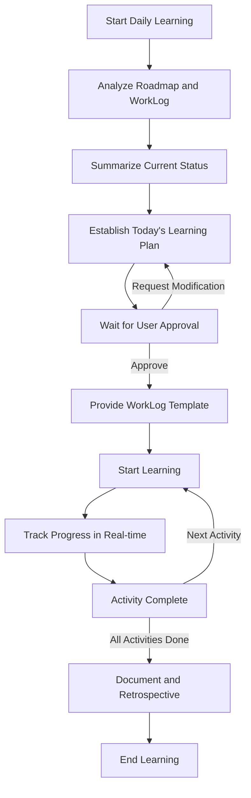

# CUA_VL Daily Learning Prompt

**Version**: 2.0
**Created**: 2025-12-28
**Methodology**: VibeLearn AI (CUA_VL)

---

## 📌 How to Use

This prompt is a universal template to be used at the start of each day's learning.

**When to use**:
- At the beginning of each daily learning session
- When a Roadmap is already prepared

**Procedure**:
1.  Fill out the [Step 1] section below with your current situation.
2.  Provide the entire content to the AI.
3.  The AI will analyze the Roadmap and WorkLog, then propose today's learning plan.
4.  Start learning after approving the plan.
5.  Write in the WorkLog in real-time as you learn.

---

## [Step 1] Current Status Information (To be filled out by the user)

### Project Basic Information

**Topic Name**:
```
[e.g., MCP-Basics]
```

**Topic Folder Path**:
```
[e.g., C:\Projects\MCP-Basics\]
```

**Roadmap File Path**:
```
[e.g., vl_roadmap/20251228_RoadMap_MCP-Basics.md]
```

---

### Learning Progress

**Current Module in Progress**:
```
[e.g., M3 - Learning Basic Functions]
```

**Most Recent WorkLog File**:
```
[e.g., vl_worklog/20251227_M3_MCP-Basics.md]
or
[None - first learning session]
```

**"Tomorrow's focus" from the previous session** (if any):
```
[Next tasks recorded in the previous WorkLog]
or
[None]
```

---

### Today's Learning Environment

**Available Time**:
```
[e.g., 3 hours]
[e.g., 2 hours in the morning + 1 hour in the afternoon]
```

**Today's Condition/Constraints** (if any):
```
[e.g., Feeling tired - prioritize low-difficulty tasks]
[e.g., Unstable internet - focus on offline materials]
[None]
```

---

## [Step 2] Task to Request from the AI

Based on the information above, please create today's learning plan according to the **CUA_VL methodology**.

---

## Learning Plan Creation Process

**AI, please proceed with the tasks in the following order:**

### Step 1: Analyze Roadmap and Previous WorkLog

#### 1.1 Analyze Roadmap
1.  **Read Roadmap File**
    -   Check the Roadmap file at the path provided by the user.
    -   Understand the overall module structure.
    -   Confirm the current module's position.

2.  **Extract Current Module Information**
    -   Learning Objectives
    -   Key Concepts
    -   Practical Exercises
    -   DoD (Definition of Done)
    -   Estimated Time

3.  **Calculate Overall Progress**
    -   Completed Modules / Total Modules
    -   Estimated remaining time

#### 1.2 Analyze Previous WorkLog (if it exists)
1.  **Read WorkLog File**
    -   Check the most recent WorkLog.
    -   Review the completed task checklist.
    -   Check the DoD completion rate.

2.  **Identify Unfinished Tasks**
    -   Unchecked learning objectives.
    -   Incomplete practical exercises.
    -   Pending tasks.

3.  **Check for Problems and Insights**
    -   Problems encountered and whether they were resolved.
    -   "Tomorrow's focus" from the Daily Retrospective.
    -   Any special notes.

4.  **Status of Outputs**
    -   Created folders and files.
    -   Whether documentation is complete.

#### 1.3 Output Current Status Summary
```markdown
## 📊 Current Learning Status

**Topic**: {Topic Name}
**Overall Progress**: M{X} / M{Total} (XX%)
**Current Module**: M{X} - {Module Name}
**Module DoD Completion Rate**: X/Y (XX%)

**Completed Tasks**:
- [x] Task 1
- [x] Task 2

**Unfinished Tasks**:
- [ ] Task 3
- [ ] Task 4

**Previous Session Issues**:
- {Summary of problems encountered}

**Tomorrow's focus** (from previous WorkLog):
- {What to do next}
```

---

### Step 2: Establish Today's Learning Plan

**Create a realistic plan considering the user's available time and condition.**

#### 2.1 Determine Priorities
1.  **Prioritize unfinished tasks** (from the previous WorkLog)
2.  **Achieve current module's DoD** (if the module is near completion)
3.  **New learning objectives** (if the module has just started)

#### 2.2 Allocate Time
-   User's available time: {X hours}
-   Excluding 20% buffer: {Actual work time}
-   Adjust based on estimates:
    -   If time is insufficient → Split tasks or simplify.
    -   If time is sufficient → Add extra practice or start a part of the next module.

#### 2.3 Output Learning Plan
```markdown
## 📋 Today's Learning Plan

**Learning Time**: {X hours}
**Target Module**: M{X} - {Module Name}

### 🎯 Today's Objectives (in order of priority)

1.  **{Objective 1}** (⭐⭐⭐ Essential)
    -   Task: {Specific task}
    -   Estimated Time: X minutes
    -   Output: {File/Folder}

2.  **{Objective 2}** (⭐⭐ Important)
    -   Task: {Specific task}
    -   Estimated Time: X minutes
    -   Output: {File/Folder}

3.  **{Objective 3}** (⭐ Optional)
    -   Task: {Specific task}
    -   Estimated Time: X minutes
    -   Output: {File/Folder}

### 📝 Detailed Execution Plan

#### Activity 1: {Activity Name} (XX:XX - XX:XX, X min)
**Purpose**: {Why you are doing this activity}

**Steps**:
1.  {Specific step 1}
2.  {Specific step 2}
3.  {Specific step 3}

**Success Criteria**: {How to verify}
**Reference**: {Relevant section in Roadmap or reference material}

---

#### Activity 2: {Activity Name} (XX:XX - XX:XX, X min)
{Same format}

---

#### Activity 3: Documentation and WorkLog Writing (XX:XX - XX:XX, X min)
**Purpose**: Organize and record today's learning.

**Tasks**:
1.  Organize output folders.
2.  Write/update README.md.
3.  Finalize WorkLog.
4.  Write Daily Retrospective.

---

### 📂 Files to Create/Update Today

**WorkLog**:
- `vl_worklog/YYYYMMDD_M{X}_{Topic}.md`

**Output Folder**:
- `0{X}-{ModuleName}/`
  - README.md
  - concepts/{filename}.md
  - examples/{filename}.py
  - (etc.)

---

### ⏰ Timeline

| Time          | Activity    | Estimated Duration |
|---------------|-------------|--------------------|
| XX:XX - XX:XX | Activity 1  | X min              |
| XX:XX - XX:XX | Activity 2  | X min              |
| XX:XX - XX:XX | Break       | 10 min             |
| XX:XX - XX:XX | Activity 3  | X min              |
| XX:XX - XX:XX | Documentation | X min              |

**Total Estimated Time**: Xh (including 20% buffer)

---

### ✅ Today's DoD (Checklist)

**Learning Objectives**:
- [ ] {Achieve Objective 1}
- [ ] {Achieve Objective 2}
- [ ] {Achieve Objective 3}

**Outputs**:
- [ ] Create {File 1}
- [ ] Write {File 2}
- [ ] Update README.md

**Documentation**:
- [ ] Write WorkLog
- [ ] Complete Daily Retrospective

**Module DoD Progress**: X/Y → {Expected} / Y

---

### 💡 Learning Tips

{1-2 tips that will be helpful for today's learning}

---

### 🔗 References

-   Roadmap: {Relevant module section}
-   Previous WorkLog: {Filename}
-   {Other references}
```

---

### Step 3: Wait for User Approval

Present the learning plan and ask for the user's confirmation:

```markdown
---

## 👉 User Confirmation Needed

Do you want to proceed with the learning plan above?

**Options**:
1.  **Approve** - "Let's start" or "Go"
2.  **Request modification** - Let me know what you want to adjust.
3.  **Adjust difficulty** - "Make it easier" or "Make it more advanced."

Once you approve, I will provide the WorkLog template and we can start learning.
```

---

### Step 4: Guide to Create WorkLog File

**If the user approves:**

```markdown
## 📝 Create WorkLog File

Please create today's WorkLog file at the following path:

**File Path**: `vl_worklog/YYYYMMDD_M{X}_{Topic}.md`
**Example**: `vl_worklog/20251228_M3_MCP-Basics.md`

---

### WorkLog Template

{Provide the template below}
```

#### WorkLog Template
```markdown
# WorkLog - M{X}: {Module Name}

**Date**: YYYY-MM-DD
**Topic**: {Topic Name}
**Module**: M{X} - {Module Name}
**Learning Time**: Start XX:XX - End XX:XX (Total X hours)

---

## 🎯 Today's Learning Objectives

- [ ] {Objective 1}
- [ ] {Objective 2}
- [ ] {Objective 3}

---

## 📚 Progress Details

### 1. {Activity Name}

**Time**: XX:XX - XX:XX

**Purpose**:
{Why this task is being done}

**Process**:
1.  {Step 1}
2.  {Step 2}
3.  {Step 3}

**Result**:
- {Output or Success/Failure}
- {Location of screenshot or log}

**Notes/Insights**:
{What was learned, points to note, ideas for improvement}

---

### 2. {Next Activity Name}

(Repeat the same structure as above)

---

## 🐛 Problem Solving Log

### Problem 1: {Problem Summary}

**Symptom**:
{What went wrong and how}

**Cause**:
{Why it happened}

**Solution**:
{How it was solved - commands, code, config changes, etc.}

**Reference**:
{Doc links, Stack Overflow, full error message, etc.}

---

## 📊 DoD Checklist

Definition of Done for Roadmap M{X}:

- [ ] {DoD item 1}
- [ ] {DoD item 2}
- [ ] {DoD item 3}
...

**Completion Rate**: X/Y (XX%)

---

## 💡 Daily Retrospective

### What went well
-
-

### What could be improved
-
-

### Insights
-
-

### Tomorrow's focus
-
-

---

## 📎 References and Outputs

**Created Files/Folders**:
- `{path/filename}`: {Description}
- `{path/filename}`: {Description}

**Reference Materials**:
- [Link 1 Title](URL): {1-line description}
- [Link 2 Title](URL): {1-line description}

**Preparations for Next Session**:
- {Thing to prepare 1}
- {Thing to prepare 2}

---

**Author**: {Name}
**Methodology**: CUA_VL (VibeLearn AI)
```

---

### Step 5: Start the Learning Process

If the user responds with "Let's start" or "Go":

```markdown
## 🚀 Let's start learning!

**First Activity**: {Activity 1 Name}
**Start Time**: {Current Time}

{Start guiding from the first step of Activity 1}

---

**Guidance during the process**:
-   Let me know when you complete each activity by saying "Done."
-   If you get stuck, ask questions immediately.
-   It's good to write in your WorkLog in real-time.
```

---

## [Step 3] Principles for Establishing a Learning Plan

The AI must **strictly** adhere to the following principles when creating a learning plan:

### 1. Adjustment Based on Progress

-   **Prioritize the unfinished**: Give top priority to unfinished tasks from the previous WorkLog.
-   **Focus on DoD**: Consider the completion rate of the current module's DoD.
-   **Reflect "Tomorrow's focus"**: Prioritize the next tasks from the previous retrospective.

### 2. Realistic Time Planning

-   **Adhere to available time**: Ensure it can be completed within the time specified by the user.
-   **Mandatory 20% buffer**: Secure time to handle unexpected problems.
-   **If time is short**: Split the task over two days or simplify it.
-   **If time is ample**: Suggest additional practice or a preview of the next module.

**Example**:
-   Available time 3 hours, module estimate 4 hours → Do the core today, the rest tomorrow.
-   Available time 6 hours, module estimate 3 hours → Complete the module + start the next one.

### 3. Practice First, Incremental Completion

-   **Minimize theory**: 20-30% (only essential concepts).
-   **Maximize practice**: 70-80% (doing it yourself).
-   **"Small wins" pattern**: The first activity should be an easy and quick success experience.
-   **Increasing difficulty**: Gradually increase complexity.

### 4. Verifiable Outputs

-   **Clear success criteria for every activity**: e.g., "file created," "log output."
-   **Visible results**: Outputs that can be seen.
-   **Link to DoD**: Specify how each activity contributes to achieving the DoD.

### 5. Flexibility and Adaptability

-   **Consider user's condition**: Lower the difficulty if they are tired.
-   **If progress is fast**: Suggest more advanced tasks.
-   **If stuck**: Suggest simplifying or postponing to the next session.

---

## [Step 4] Handling Special Situations

### Situation 1: Previous Module's DoD is Incomplete

If the DoD was not completed:

```markdown
⚠️ **Detected Incomplete DoD from Previous Module**

The following items from M{X-1} are incomplete:
- [ ] {Incomplete item 1}
- [ ] {Incomplete item 2}

**Recommended Action**:
1.  Complete the previous module today, then proceed to the next module (Recommended).
2.  Proceed now and complete the previous module later (Not recommended).

How would you like to proceed?
```

### Situation 2: User Requests a Specific Practice Task

If the user requests an additional task not in the Roadmap:

```markdown
**Confirmed Additional Task Request**

"{User's request}"

**Analysis**:
-   Relevance to the current module: {High/Medium/Low}
-   Estimated time required: {X hours}
-   Integrate into Roadmap?: {Yes - where / No - proceed separately}

**Suggestion**:
{Do it today / Separate session / After module completion}

How would you like to proceed?
```

### Situation 3: First Session (No WorkLog)

If there is no WorkLog:

```markdown
ℹ️ **First Learning Session**

Since there is no previous WorkLog:
1.  We will start from M1 of the Roadmap.
2.  We will prioritize environment setup and preparation tasks.
3.  The first practice will be at a "Hello World" level.

Shall we begin?
```

### Situation 4: User is Not in Good Condition

If the user is tired or has constraints:

```markdown
💡 **Adjusting Learning Plan**

User's condition: {Tired / Unstable internet, etc.}

**Adjustments**:
-   Difficulty ⭐⭐⭐ → ⭐ (Focus on easy tasks)
-   Recommend review and documentation over new learning.
-   Reduce the number of objectives: 3 → 1-2.

Shall we proceed with this adjusted plan?
```

---

## [Step 5] Track Progress (During Learning)

Continuously update the following information while learning is in progress:

### Real-time Progress

```markdown
## 📊 Current Progress

**Current Time**: XX:XX
**Time Elapsed**: X hours XX minutes
**Time Remaining**: X hours XX minutes

**Completed Activities**:
- [x] Activity 1 ✅
- [x] Activity 2 ✅

**Currently In Progress**:
- [ ] Activity 3 (60% complete)

**Pending**:
- [ ] Activity 4
- [ ] Documentation

**DoD Completion Rate**: X/Y (XX%) → {Expected at end} / Y
```

### Time Management Notification

```markdown
⏰ **Time Checkpoint**

-   Planned end time: XX:XX
-   Time remaining: X hours XX minutes
-   Remaining activities: {count}

**Status**: {On track / Delayed / Expected to exceed}

{If delayed} Suggested adjustments:
-   Move activity X to the next session.
-   Simplify activity Y.

Do you need to make any adjustments?
```

---

## ✅ Pre-learning Checklist

Check before the user starts learning:

```markdown
## ✅ Pre-start Checklist

**Environment**:
- [ ] Development environment is runnable (IDE, Terminal, tools).
- [ ] Necessary files/folders are accessible.
- [ ] Internet connection (if needed).

**Plan**:
- [ ] Understood today's learning objectives.
- [ ] Checked and agreed to the estimated time.
- [ ] Confirmed the location for outputs.

**WorkLog**:
- [ ] Ready to create the WorkLog file.
- [ ] Reviewed the template structure.

**✅ When ready, please enter "Let's start" or "Go".**
```

---

## 🎯 Learning Flow Summary



---

**Template Version**: 2.0
**Created**: 2025-12-28
**Methodology**: CUA_VL (VibeLearn AI)
